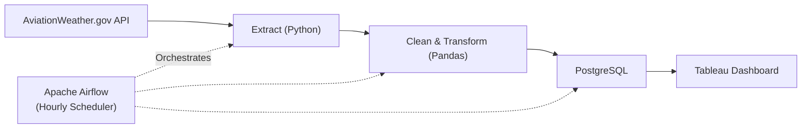

# aviation weather ETL pipeline

During an operations internship in the ferry transport industry,I worked on preparing operational data for Power BI dashboards. Although I was involved in cleaning and transforming data, the underlying database and refresh processes were managed by another team, so I could not explore workflow automation.

This project is my way of closing that gap by building a real, end-to-end automated ETL pipeline from scratch, using a similarly operations-heavy dataset (aviation weather) so the skills would transfer directly back to that domain.

## Table of Contents 
- API
- Overview of Project
- Challenges 
- Tech Stack
- Future Improvements 

## API

Data is sourced from :[Aviation Weather API](https://aviationweather.gov/help/data/#metar)

Per the Federal Meteorological Handbook No. 1, a METAR (Meteorological Aerodrome Report) contains wind, visibility, runway visual range, present weather, sky condition, temperature, dew point, and altimeter setting.Each report is tied to a 4-character ICAO airport code.

Airports covered:
- WSSS (Changi)
- WSSL (Seletar)
- WSAP (Paya Lebar)

I limited the scope to these 3 airports because intermediate data is passed between Airflow tasks via XCom, which has a size limit and a larger set of airports or a longer historical window wouldn't fit reliably.

## Overview of Project

The pipeline runs on an hourly schedule via Airflow and performs the following steps:

1. Extract — Pull the latest METAR report for each of the 3 ICAO codes from the AviationWeather.gov API.
2. Clean — Parse the raw METAR string, handle missing/malformed fields, and deduplicate reports (see Challenges).
3. Transform — Convert coded values (wind, visibility, sky condition, altimeter, etc.) into structured, analysis-ready fields.
4. Load — Write the transformed records into a local PostgreSQL instance.
5. Visualise — During development, Tableau Desktop connects to the local PostgreSQL database to display the latest weather observations.

## Initial Challenges 

<Talk about duplicate handling >

2. XCom Size Limits
Airflow's XCom is meant for small metadata payloads, not bulk data transfer. This constrained how many airports/how much history I could pass between tasks in a single DAG run, which directly shaped the decision to scope this to 3 airports (see Data Source).

## Tech Stack
- Python (data cleaning)
- PostgreSQL
- Apache Airflow
- Docker
- Tableau

## Future Improvements
- Deploy PostgreSQL on a cloud service for remote access
- Replace XCom data passing with object storage for larger datasets
- Add data quality validation using Great Expectations
- Deploy the Airflow instance to a cloud environment
- Implement monitoring and alerting for failed pipeline runs
