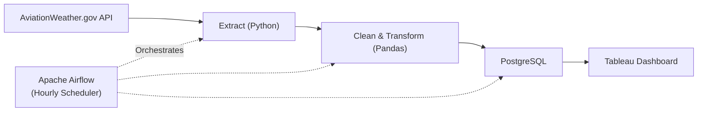

# aviation weather ETL pipeline

During an operations internship in the ferry transport industry, I worked on preparing operational data for Power BI dashboards. The process of extracting, cleaning, and visualising the data was largely manual and disconnected. It was difficult to introduce automation because the underlying database and refresh processes were outsourced, limiting my ability to explore workflow automation. The main challenge was ensuring that the data powering the visualisations remained relevant and continuously updated.

This project is my way of addressing that gap by building a complete end-to-end ETL pipeline from scratch. I chose aviation weather data because it is similarly operations-focused and requires continuous updates, allowing me to develop skills that transfer directly to operational analytics and data engineering workflows.

## Table of Contents 
- API
- Overview of Project
- Challenges 
- Tech Stack
- Future Improvements 

## API

Data is sourced from :[Aviation Weather API](https://aviationweather.gov/help/data/#metar)

Per the Federal Meteorological Handbook No. 1, a METAR (Meteorological Aerodrome Report) contains wind, visibility, runway visual range, present weather, sky condition, temperature, dew point, and altimeter setting.Each report is tied to a 4-character ICAO airport code.

Airports covered:
- WSSS (Changi)
- WSSL (Seletar)
- WSAP (Paya Lebar)

I limited the scope to these 3 airports because intermediate data is passed between Airflow tasks via XCom, which has a size limit and a larger set of airports or a longer historical window wouldn't fit reliably.

## Overview of Project

The pipeline runs on an hourly schedule via Airflow and performs the following steps:

1. Extract — Pull the latest METAR report for each of the 3 ICAO codes from the AviationWeather.gov API.
2. Clean — Parse the raw METAR string, handle missing/malformed fields, and deduplicate reports (see Challenges).
3. Transform — Convert coded values (wind, visibility, sky condition, altimeter, etc.) into structured, analysis-ready fields.
4. Load — Write the transformed records into a local PostgreSQL instance.
5. Visualise — During development, Tableau Desktop connects to the local PostgreSQL database to display the latest weather observations.

## Initial Challenges 

1. **Type consistency**
   

   XCom uses PyArrow to store data in an Arrow table between tasks. However, PyArrow requires data in each column to be of a fixed type, and since the input columns included special characters, I had to remove special characters across all columns and convert them to a fixed type in       the extract step.
   
2. **Duplicate Handling**

   

   When creating the dashboard in Tableau, I realized that there were duplicates in the data. Since I had already created the unique_id in the transform step, it was easier for me to check Postgres for any duplicates and then implement a constraint preventing more than one row with the    same unique_id from being in the table. However, this led to failures in the Airflow runs, since my pre-existing load function simply appended to the database. From SQLAlchemy, I imported MetaData and Table so that SQLAlchemy could check my table's validation rules,
   and if a duplicate were to be loaded, the pre-exisitng row's values should be updated with the new data instead of inserting second row.

4. **XCom Size Limits**
   
    Airflow's XCom is meant for small metadata payloads, not bulk data transfer. This constrained how many airports/how much history I could pass between tasks in a single DAG run, which directly shaped the decision to scope this to 3 airports (see Data Source).

## Tech Stack
- Python (data cleaning)
- PostgreSQL
- Apache Airflow
- Docker
- Tableau

## Future Improvements
- Deploy PostgreSQL on a cloud service for remote access
- Replace XCom data passing with object storage for larger datasets
- Add data quality validation using Great Expectations
- Implement monitoring and alerting for failed pipeline runs
